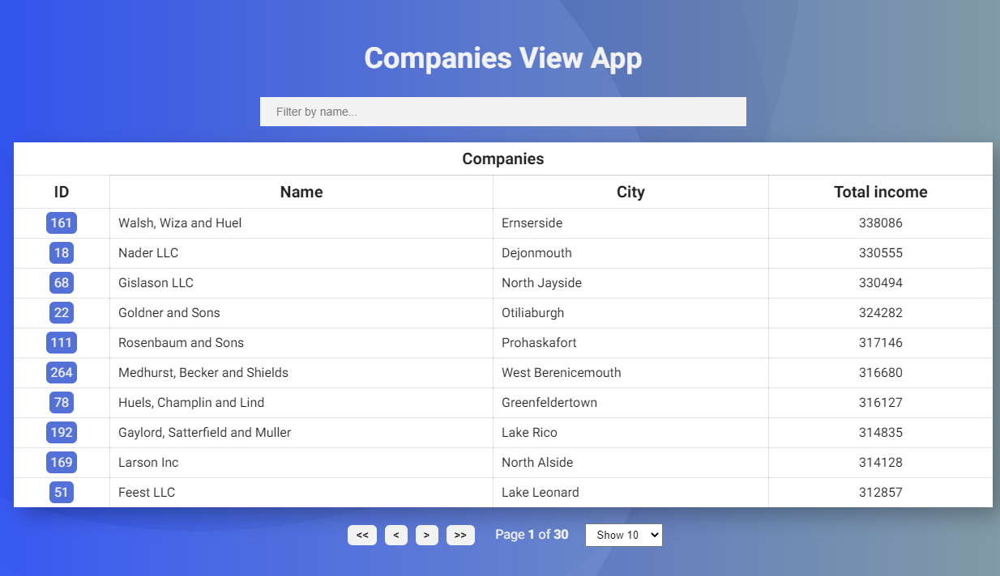

# Companies View App 

Application is fetch and display table of companies with several additional options 💪💪.

## [DEMO](https://companies-view-app.netlify.app/) 

## Screenshots

## Technologies

- react
- react-table
- react-router
- styled-components
- axios
- eslint, prettier, lint-staged, husky

## Features

- Displays data from the API in a react-table
- Table is paginated
- Clickable button [company ID] for redirection to the Details View Page

## Status

Project is: _finished_

## Contact

Created by [@erykslocinski](mailto:eryk.slocinski@gmail.com) - feel free to contact me!
